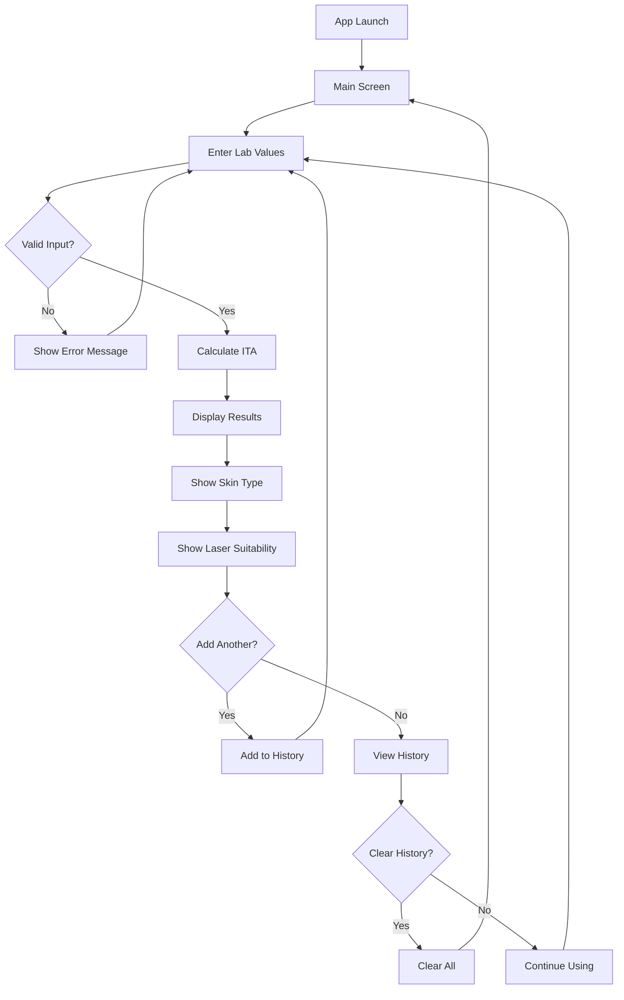

# Lab to ITA Converter - Design Wireframe & User Flow

## Mobile Interface Wireframe

### Main Screen Layout (Portrait Mode)
```
┌─────────────────────────────────┐
│  🔬 Lab to ITA Converter        │ ← Header (60px)
├─────────────────────────────────┤
│                                 │
│  📊 Enter Lab Values            │ ← Section Title
│                                 │
│  ┌─────────┬─────────┬─────────┐│
│  │   L*    │   a*    │   b*    ││ ← Input Fields (50px)
│  │  [___]  │  [___]  │  [___]  ││
│  └─────────┴─────────┴─────────┘│
│                                 │
│     [🧮 Calculate ITA]          │ ← Calculate Button (50px)
│                                 │
├─────────────────────────────────┤
│  📋 Results                     │ ← Results Section
│                                 │
│  ITA Value: 45.2°               │
│  Skin Type: Type II (Light)     │
│                                 │
│  ┌─────────────────────────────┐│
│  │ ✅ SUITABLE FOR LASER       ││ ← Status Indicator
│  │    Alexandrite Safe         ││
│  └─────────────────────────────┘│
│                                 │
├─────────────────────────────────┤
│  📝 Measurement History         │ ← History Section
│                                 │
│  1. L:65 a:12 b:18 → ITA:45.2°  │
│  2. L:58 a:15 b:22 → ITA:21.8°  │
│                                 │
│     [🗑️ Clear] [➕ New]         │ ← Action Buttons
│                                 │
└─────────────────────────────────┘
```

### Input Field Details
```
┌─────────────────┐
│ L* (Lightness)  │ ← Label
│ ┌─────────────┐ │
│ │    65.4     │ │ ← Number Input
│ └─────────────┘ │
│ Range: 0-100    │ ← Helper Text
└─────────────────┘
```

### Results Card Variations

#### Safe Result (Green)
```
┌─────────────────────────────┐
│ ✅ SUITABLE FOR LASER       │
│                             │
│ ITA: 45.2°                  │
│ Type II (Light Skin)        │
│                             │
│ Alexandrite laser is safe   │
│ for this skin type          │
└─────────────────────────────┘
```

#### Caution Result (Orange)
```
┌─────────────────────────────┐
│ ⚠️  CAUTION REQUIRED        │
│                             │
│ ITA: 15.8°                  │
│ Type IV (Tan Skin)          │
│                             │
│ Use lower energy settings   │
│ and test patch recommended  │
└─────────────────────────────┘
```

#### Not Suitable Result (Red)
```
┌─────────────────────────────┐
│ ❌ NOT RECOMMENDED          │
│                             │
│ ITA: -15.2°                 │
│ Type V (Brown Skin)         │
│                             │
│ Alexandrite laser not safe  │
│ Consider alternative laser  │
└─────────────────────────────┘
```

## User Flow Diagram



## Responsive Breakpoints

### Mobile Portrait (320px - 480px)
- Single column layout
- Full-width input fields
- Stacked buttons
- Large touch targets (44px minimum)

### Mobile Landscape (481px - 768px)
- Horizontal input layout
- Side-by-side buttons
- Compact history view

### Tablet (769px+)
- Two-column layout option
- Larger result cards
- Enhanced history table view

## Touch Interactions

### Gestures
- **Tap**: Select input fields, buttons
- **Swipe Left/Right**: Navigate between measurements
- **Pull to Refresh**: Clear current inputs
- **Long Press**: Copy result values

### Feedback
- **Visual**: Button press states, input focus
- **Haptic**: Success/error vibrations (where supported)
- **Audio**: Optional confirmation sounds

## Accessibility Features

### Screen Reader Support
- Semantic HTML structure
- ARIA labels for all interactive elements
- Descriptive alt text for icons
- Logical tab order

### Visual Accessibility
- High contrast color scheme
- Scalable text (up to 200%)
- Clear focus indicators
- Color-blind friendly palette

### Motor Accessibility
- Large touch targets (44px minimum)
- Generous spacing between elements
- Voice input support
- Keyboard navigation

## Error States

### Input Validation Errors
```
┌─────────────────────────────┐
│ ❌ Invalid L* Value         │
│                             │
│ Please enter a number       │
│ between 0 and 100           │
│                             │
│ [Try Again]                 │
└─────────────────────────────┘
```

### Calculation Errors
```
┌─────────────────────────────┐
│ ⚠️  Cannot Calculate        │
│                             │
│ b* value cannot be zero     │
│ Please check your input     │
│                             │
│ [Correct Values]            │
└─────────────────────────────┘
```

## Loading States

### Calculation in Progress
```
┌─────────────────────────────┐
│ 🔄 Calculating ITA...       │
│                             │
│ [Progress Spinner]          │
└─────────────────────────────┘
```

## Animation Guidelines

### Micro-interactions
- Button press: 150ms scale animation
- Input focus: 200ms border color transition
- Result reveal: 300ms slide-up animation
- Error shake: 400ms horizontal shake

### Page Transitions
- Smooth scrolling between sections
- Fade transitions for state changes
- Slide animations for history navigation

## Color Psychology for Medical Use

### Color Meanings
- **Green (#18A558)**: Safe, proceed with confidence
- **Orange (#F39C12)**: Caution, requires attention
- **Red (#E74C3C)**: Danger, do not proceed
- **Blue (#2E86AB)**: Professional, trustworthy
- **Gray (#95A5A6)**: Neutral, informational

### Usage Guidelines
- Use color + icons for accessibility
- Maintain sufficient contrast ratios
- Consistent color meaning throughout app
- Professional medical aesthetic